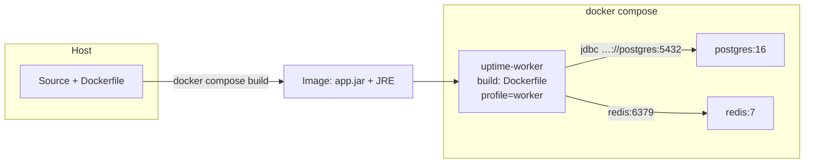
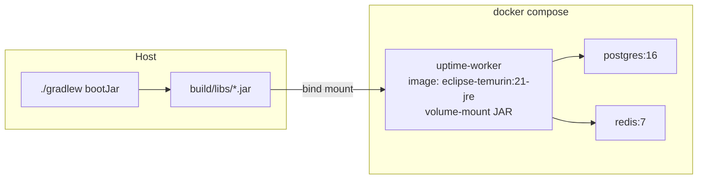
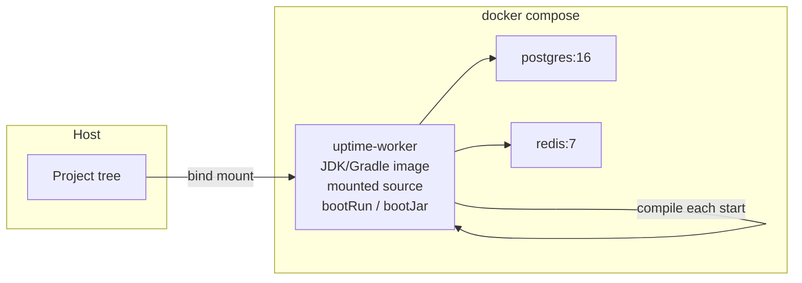
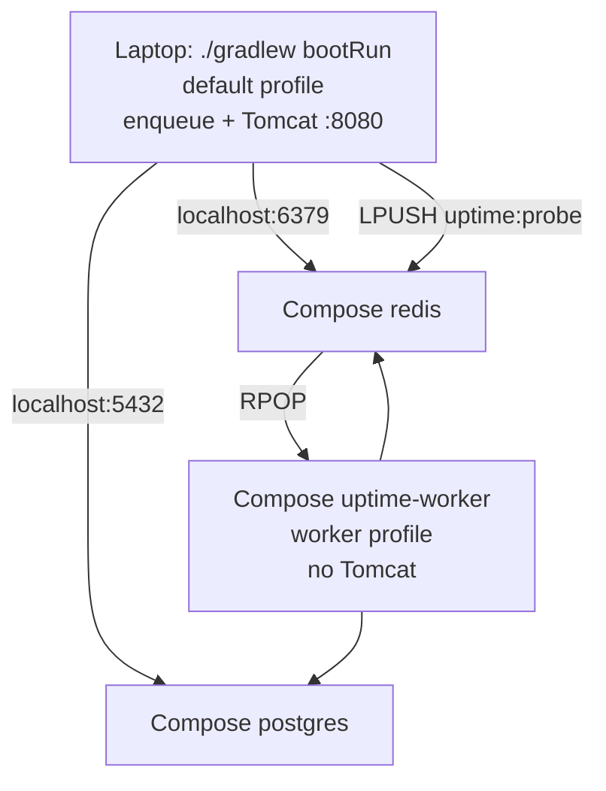

# Packaging the Spring app for Docker

Postgres and Redis already have public images. **This app** does not — something must put your JAR into a container. Three common approaches:

| | How the app gets into Docker | Compose’s job |
|--|--|--|
| **A — Dockerfile (chosen)** | Build an image that contains the JAR | `build:` + env + depends_on |
| **B — Host JAR + stock JRE** | You run `./gradlew bootJar`; Compose mounts the JAR | `image: eclipse-temurin` + volume + `command` |
| **C — Dev: source + Gradle in container** | Mount the repo; container runs Gradle | Slow; OK for experiments only |

**Roles**

- **Dockerfile** — recipe for one **image** (build + default `java -jar`). Does not start Postgres/Redis by itself.
- **compose.yaml** — runs **services** together (network names, env, healthchecks). For this app it either `build:`s the Dockerfile (A) or runs a stock JDK/JRE image (B/C).

Laptop `bootRun` uses `localhost` for DB/Redis (published ports). A **container** must use Compose **service names** (`postgres`, `redis`), not `localhost`.

Do not run two consumers on `uptime:probe` (laptop worker **and** Compose worker).

---

## Approach A — Dockerfile + Compose `build` (this repo)

1. Compose runs `docker build` from the Dockerfile (multi-stage: Gradle `bootJar` → Temurin JRE).
2. Worker container starts with `SPRING_PROFILES_ACTIVE=worker` and DB/Redis hosts pointing at Compose services.
3. Same image can later run a **web** service (default profile, port 8080) with different env.

---

## Approach B — No Dockerfile; mount a host-built JAR

- Compose service uses a public JRE image and `command: java -jar /app/app.jar`.
- You rebuild the JAR on the host before every code change you want in the container.
- Image is not self-contained for CI/other machines unless they also run Gradle first.

---

## Approach C — Mount source; Gradle inside the container

- Fast to try “run my tree in Docker”; slow and heavy for daily use (downloads + compile on start).
- Not the packaging story for production-like Compose.

---

## Typical 014 layout (A + laptop API)

Later: add a Compose `web` service from the same Dockerfile if you want the API in Docker too.
